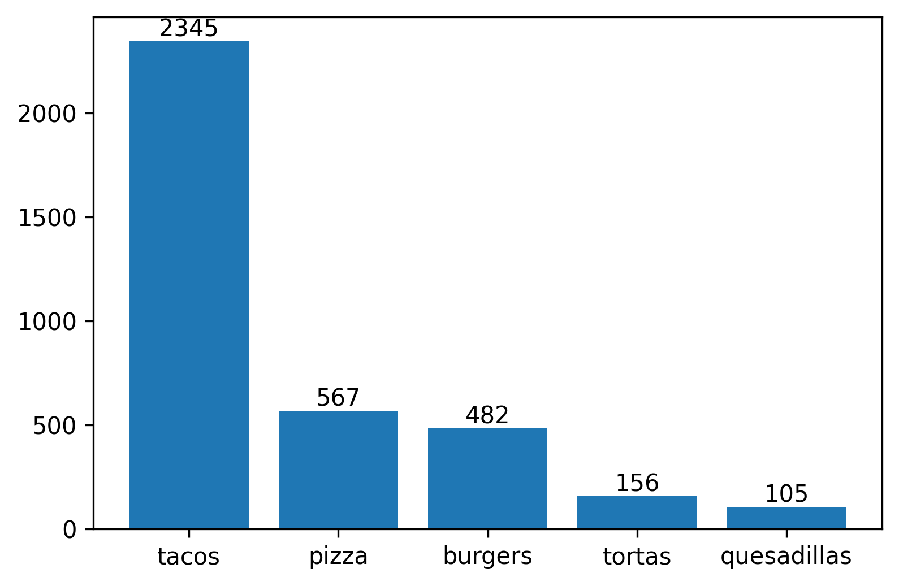

# Clustering of Neighborhoods by Mexican Food Type: Final Report

## 1. Introduction

Let's say we are in the food business, specifically, Mexican street food (e.g. tacos, tortas, pizza, etc.) and we want to start new branches in Mexico City. How can we decide where to place our new branches? We would like to avoid high competition, but at the same time, we want to be in places with great demand for our type of food. If for instance, we want to sell tacos, what locations in the city might be the best to place our branches?

To try to answer these questions, I cluster neighborhoods in Mexico City according to the presence of a couple of Mexican food types: quesadillas, tacos, pizza, tortas, and hamburgers. To collect this data I use the Foursquare API. Then, I implement k-means clustering to group neighborhoods into clusters that help to identify neighborhoods where a type of food is preferred. This will indicate where there is high competition in certain food types and where there is a high demand for that food type.

## 2. Data

1. We firstly collect postal codes for Mexico City from the Mexican Postal Service's website:

* https://www.correosdemexico.gob.mx/SSLServicios/ConsultaCP/CodigoPostal_Exportar.aspx

    This data is used to obtain geo-coordinates for each neighborhood in Mexico City by using the _pgeocode_ library.
    
    A sample of these data looks like this:
    
    
| Index | Postal Code | Neighborhood    | Borough                        | Latitude | Longitude |
|-------|-------------|-----------------|--------------------------------|----------|-----------|
| 0     | 01000       | San Ángel       | Álvaro Obregón                 | 19.3587  | -99.20330 |
| 1     | 01010       | Los Alpes       | Álvaro Obregón                 | 19.3569  | -99.21000 |
| 2     | 01020       | Guadalupe Inn   | Álvaro Obregón                 | 19.5161  | -99.14190 |
| 3     | 01030       | Axotla, Florida | Álvaro Obregón, Álvaro Obregón | 19.3556  | -99.17835 |
| 4     | 01040       | Campestre       | Álvaro Obregón                 | 19.3556  | -99.19180 |
    
    
2. Once we have postal codes for each negihborhood, we use the [Foursquare API](https://developer.foursquare.com/developer/) to collect trending venues in each neighborhood. 
    This dataset looks like this:
    
    
| Index | Neighborhood     | Borough | Neighborhood Latitude | Neighborhood Longitude | Venue                           | Latitude  | Longitude  | Venue Category     |
|-------|------------------|---------|-----------------------|------------------------|---------------------------------|-----------|------------|--------------------|
| 22103 | San Pedro Mártir | Tlalpan | 19.2665               | -99.17                 | Centro de nutrición Casa Blanca | 19.265388 | -99.167554 | Athletics & Sports |
| 22104 | San Pedro Mártir | Tlalpan | 19.2665               | -99.17                 | Las Quekas De "Don Fer"         | 19.265361 | -99.167104 | Snack Place        |
| 22105 | San Pedro Mártir | Tlalpan | 19.2665               | -99.17                 | Café Añu                        | 19.265204 | -99.166857 | Snack Place        |
| 22106 | San Pedro Mártir | Tlalpan | 19.2665               | -99.17                 | The Food Stop                   | 19.268408 | -99.166852 | Food Truck         |
| 22107 | San Pedro Mártir | Tlalpan | 19.2665               | -99.17                 | Aqua Sur                        | 19.265319 | -99.165622 | Gym Pool           |       |
    
    
    
   
   We clean the resulting dataset to keep only mexican food venues. This final dataset is the input for our clustering analysis.

## 3. Methodology

#### Data analysis

When analyzing our Foursquare dataset, regarding food category frecuencies, we note in the next graph that tacos is by far the most common food type:

After cleaning our Foursquare dataset, we obtain our final dataset which is the input for our cluster analysis. This final dataset looks like this:

| Index | Neighborhood                                      | burgers | pizza | quesadillas | tacos    | tortas   |
|-------|---------------------------------------------------|---------|-------|-------------|----------|----------|
| 0     | 10 de Abril                                       | 0.25    | 0.0   | 0.0         | 0.500000 | 0.250000 |
| 1     | 12 de Diciembre, San Andrés Tomatlán, San Andr... | 0.25    | 0.0   | 0.0         | 0.750000 | 0.000000 |
| 2     | 15 de Agosto                                      | 0.00    | 0.0   | 0.0         | 1.000000 | 0.000000 |
| 3     | 16 de Septiembre                                  | 0.20    | 0.0   | 0.0         | 0.800000 | 0.000000 |
| 4     | 1a Sección Cañada, 2a Sección Cañada              | 0.00    | 0.0   | 0.0         | 0.857143 | 0.142857 |

Where every food column indicates the proportion of ocurrencies of that food type in the total of food places in every neighborhood (i.e. its representativeness). For instance, for the first neighborhood in our dataset, out of all its food places, 25% sell hamburgers, 50% tacos, and 25% tortas. 

#### Machine Learning Approach
Once the dataframe is cleaned and we have done exploration about the frecuency of each food category, I implement k-means clustering. I decided to apply k-means clustering since we want to categorize neighborhoods, but we don't have a given classification. Additionally, k-means clustering is easy to implement and computationally eficient.

Before instantiate k-means cluster we must decide which number of cluster is optimun. To decide so, I use the elbow method, based on the sum of squared distances of samples to the nearest cluster centre.

In the next graph I show this measure for variuous cluster numbers, based on which we find the best cluster number is k=5.

I then estimate clusters for k=5. Ocurrencies per cluster are show in the next table:

| Cluster | Occurrencies |
|---------|--------------|
| 0       | 390          |
| 1       | 215          |
| 4       | 102          |
| 2       | 75           |
| 3       | 28           |

Before analysing each cluster characteristics, we do some graphical analysis to verify an appropiate grouping of observations.

In the next figure we can see there seems to be an appropiate grouping per cluster. Besides, we can start to note some insights. For instance, in cluster 0, the is a predominance of tacos, while in cluster 1 pizza places are more common.

When adding a thrid food category, we note in the next figure that, for instance, cluster 2 is somewhere beetween cluster 0 and cluster 1, meaning a more balanced combination of tacos, pizza, and tortas places.

To acctually visualize the geographical distribution of clusters, we plot the next map, centerd in Mexico City. This will help to effectively know where we will place our potential new branches. Colors for each cluster are the same as the previous graphs.

## 4. Results

In what follows, I analyze each cluster based on its food type predominance.

In the next table I start by presenting the percent of predominance of each food type.

| Clus_km | burgers  | pizza    | quesadillas | tacos    | tortas   |
|---------|----------|----------|-------------|----------|----------|
| 0       | 0.063307 | 0.039313 | 0.018002    | 0.875768 | 0.003609 |
| 1       | 0.134216 | 0.409322 | 0.010247    | 0.441836 | 0.004378 |
| 2       | 0.700968 | 0.024325 | 0.004167    | 0.26454  | 0.006    |
| 3       | 0.077381 | 0.083333 | 0.52381     | 0.315476 | 0        |
| 4       | 0.087537 | 0.109599 | 0.016388    | 0.543003 | 0.243473 |

#### Cluster 0
This is the most common cluster. We note it is characterized by a overwhelming presence of tacos venues. In the map above we don't see any important geo-pattern in its distribution since all neighborhoods belonging to this cluster are uniformly distribuited across the city. Nontheless, we see some dense zones, with importat presence of cluster 0.

#### Cluster 1
This is the second most common cluster. We note it is characterized by a predominance of pizza and tacos bussinesses. The other food types remain weakly represented. In the map above we don't see any geo-pattern since this cluster is uniformly distribuited across the city. Nontheless, alike to cluster 0, we note some zones with high predominance and grouping of cluster 1.

#### Cluster 2
This cluster is the second less common. We note it is characterized by an important predominance of hamburger places with a weaker presence of tacos. The other food types are not importantly present. Likewise, we don't see any geo-pattern.

#### Cluster 3
This is the less common cluster. We note it is characterized by an important predominance of quesadillas businesses with a weaker presence of tacos. The other food types are not importantly present. Likewise, we don't see any geo-pattern.

#### Cluster 4
This is the 3rd most common cluster. We note it is characterized by an important predominance of tacos business with a weaker presence of tortas and pizza. The other food types are not importantly present. For this cluster we see a geo-pattern, where most of branches place in the city center.

## 5. Discussion

So far I carried out an analysis well structured enough to be useful for food businesses to decide where to start a new branch in the city. Nonetheless, we must be cautious with some limitations. As mentioned before, to find that a certain type of food is predominant in a neighborhood and that there are a lot of businesses that sell that food type, also implies that there is high competition in that economic market in that neighborhood. In other words, if for instance in a neighborhood is preferred pizza over the rest of the food types, it is suggestive but not indicative that we should place our new business in that neighborhood. Competition might be really high in that market that the entrance might no be feasible. Therefore, a final decision on whether a neighborhood is suitable to start a new branch must come accompanied by a market analysis about the competition conditions in that neighborhood.

## 6. Conclusions

We have identified neighborhhods by the prdominance of certain mexican food: hamburgers, pizza, quesadillas, tacos, and tortas. To group neighborhoods according to this predominance, we implement k-means clustering. Our cluster analysis yields 5 groups of neighborhoods well differentiated and that reflect the food preference in every neighborhood in Mexico City.

This information might be helpful to decide where to start a new business, depending on the type of food we want to offer. Le't say we want to start a new quesadillas bussiness, then we now know that in neighborhoods in cluster 2 there is high demand for this type of food given the predominance of these bussinesses. At the same time, this also implies there is high competition here. 
